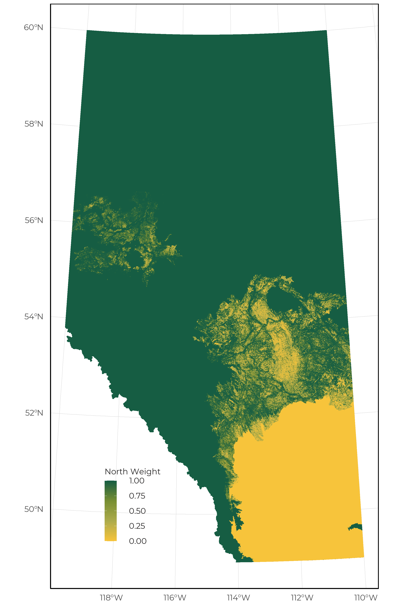

# Modeling Framework

Species distribution models (SDMs) are used to show how species relative occurrence or abundance differed among vegetation, soil and human footprint types in the northern, and southern regions of Alberta. We implemented a nested SDM framework which uses predictions from a global bioclimatic model as a covariate in the regional model that captures habitat relationships (covariate nesting ensemble, Adde et al., 2023). 

## Sampling design adequacy and detection issues

ABMI’s monitoring program is designed to determine habitat associations and track population trends for common species. We survey a systematic grid of 1656 sites, located approximately 20 km apart. The chosen sampling methods, however, do not capture all species effectively, including species that live in rare patchy habitats. A number of species are inadequately sampled or detected, because:

* Survey season is not optimized (too early/too late) to sample the species when their characteristic features (flowers, and seeds) for field identification are available to distinguish them from similar species in the field. Problematic vascular plants are downgraded to genus or family level in the data.
* Survey protocol is not designed to sample specific species within taxonomic groups (e.g., crustose lichens).
* The species is part of taxonomically complex groups which makes it difficult to distinguish them. This applies particularly for lichens and bryophytes, and a few vascular plants. These species are analyzed at genus level or species group level.
* A low sampling effort throughout the Rocky Mountains.
* Their habitats are not well sampled (e.g., waterfowl, shorebirds).
* Their nocturnal activity periods are not well sampled (e.g., rails, owls).
* They vocalize irregularly or infrequently.
* Their home range is at a much larger spatial scale than sampled by point counts (e.g., raptors, owls).

## Sample size 

ABMI conducts separate analyses for two regions: vegetation-based models for the Northern region (Boreal, Canadian shield, Foothills, Parkland, and Rocky Mountain natural regions), which is vegetation-based and soil-based models for the Southern region (Grassland, Parkland natural regions and the Dry Mixedwood natural subregion), which is soil based. The vegetation-based models require on average 20 degrees of freedom (df) with habitat/age/climate terms in the models. The soil-based models require on average 10 df with soil/climate terms in the model. Accordingly, modeling is carried out for all species that occur in at least 20 sites in an analysis region. 

## Detectability

The probability that a bird will vocalize is dependent on several seasonal and environmental factors. If we don’t correct for this probability of detection, we might mis-interpret absences as a signal of unsuitable habitat, when in reality the survey occurred outside the breeding season and we wouldn’t expect birds to be calling even if present. We used the R package QPAD (Solymos 2013) to calculate statistical offsets for detection probability in all of our bird models. For amphibians, a similar statistical offset for each species was calculated based on the time of year and hourly temperature at the time of recording. 

## Bioclimatic models

To represent the geographic and bioclimatic distributions of species in Alberta, we developed a suite of models that use flexible relationships between geography and climate. These models are developed at the provincial scale (i.e., global model as defined by Adde et al., 2023), whereas the landcover models are geographically restricted and are considered regional models. The downscaled bioclimatic variables used in the provincial models were calculated using the ClimateNA tool (version 7.4) based on the 1991-2020 climate normals (Wang et al., 2016) and additional bioclimatic variables were calculated using the dismo R package (Hijmans et al., 2022; table 1.0). Each taxonomic group was able to utilize a unique set of these candidate variables that best suited their ecology.

**Table 1.0.** Bioclimatic variables extracted from the ClimateNA tool or the dismo R package that are used to generate provincial bioclimatic models.

| Variable | Definition | Source |
|:---|:---|:---|
| MAT | Mean annual temperature | ClimateNA |
| EMT | Extreme Minimum Temperature | ClimateNA |
| FFP | Frost-free Period | ClimateNA |
| TD | Temperature differences between mean warm month temperature and mean cold month temperature | ClimateNA |
| MAP | Mean annual precipitation | ClimateNA |
| CMD | Hargreaves climate moisture deficit | ClimateNA |
| Eref | Hargreavess reference evaporation | ClimateNA |
| Bio9 | Mean temperature of driest quarter | ClimateNA, dismo |
| Bio15 | Precipitation seasonality | ClimateNA, dismo |
| Easting | Spatial coordinates (UTM 10) | |
| Northing | Spatial coordinates (UTM 10) | |

For each taxonomic group, we defined a suite of candidate models and implemented an ensemble modeling approach using corrected Akaike Information Criterion. The predictions from this ensemble model were used as a single covariate (i.e., Climate) in the regional landcover models.

## Landcover models

We use a set of statistical models to relate the occurrence or relative abundance of each species measured at ABMI sites to two sets of variables: native landcover (vegetation or soil) and human footprint type. The reason for using two regional models (i.e., northern vegetation and southern soil) is that the number of vegetation classes available in provincial landcover products were limited in the south (e.g., grass, shrub, and water). This resulted in SDMs that were primarily driven by bioclimatic relationships and were insensitive to habitat change. Vegetation, soil, and human footprint information was summarized for each 50 m x 50 m quadrat.

Vegetation types in the North region are based on several province-wide GIS layers of vegetation variables, and include main forest stand types (white spruce, pine, deciduous, mixedwood, black spruce) by broad age classes (0-9 years, 10-19 years, then 20-year classes to 140+ years) and several categories of treed (treed fen, treed swamp), shrubby (shrubby bog, shrubby fen, shrubby swamp) and open (graminoid fen, marsh, upland grass, upland shrub) vegetation. In the South, ‘vegetation types’ are broad soil types, such as productive, rapid draining, etc. The South models also include a term for the probability that the site is or was naturally treed. 

Several categories of human footprint are distinguished in the models, including cultivation (crop, rough pasture, and tame pasture), rural residential, urban/industrial, rural residential, wellsites, forestry, soft (vegetated) linear features and hard (unvegetated) linear features. Forestry footprint is differentiated by broad stand type and the same age classes as natural forest (although we have limited samples in forestry areas >20 years old). 

The analysis is conducted in a ‘model selection framework’, which means that the models for each species are only as complex as the data for that species support. For example, the models for a rarer species with few records may not be able to separate different age classes or even broad stand types. All age classes or several stand types therefore have the same average value in the resulting habitat model. This does not mean that there are truly no differences between these types for that species. It just means that we do not yet have enough data to estimate abundances in all those individual vegetation types. 

For both modeling regions, we evaluated two methods for creating the single ensemble landcover model: 1) AUC model weighting; 2) Inverse variance weighting. On average, both approaches produced similar results. Therefore, we adopted the inverse variance weighting approach for all species in these taxonomic groups.

## Integrating data sources

Birds models are developed using a variety of data sources collected by the ABMI, our partner organizations, and publicly available data sources such as eBird. Survey data was standardized by using the R package QPAD.

Amphibian models are developed only using occurrence records collected by the ABMI and our partner organizations. These data were all collected through the use of autonomous recording units. We standardize all recording types to include only the first minute of a recording.

Mammal models are developed only using camera trap data collected by the ABMI and our partner organizations. The observed densities at each camera were standardized before being modeled based on the height of the camera, camera model, deployment on game trails, and the use of lures.

Lichen, bryophyte, vascular plant, and soil mite models are developed only using occurrence records collected by the ABMI. However, the protocols used to collect this information have changed over time. Therefore, we add a statistical offset to account for protocol differences when appropriate. 

## Integrating regional models

For species for which there is a sufficient sample to produce both vegetation and soil based models, we use weights to combine the two sets of predictions for weighting the predictions in regions where either model would be suitable (i.e., Parkland and Dry Mixedwood subregion). This weight is based on the probability an area supports trees (pAspen), the amount of unknown soil information (pSoil), and the amount of treed areas (pFor) and is calculated as follows:

$$North\ weight =  \frac{pAspen}{pAspen - (1-pFor)}$$

$$South\ weight = (1- pAspen) * (1-pSoil) * (1- pFor)$$

$$North\ weight =  \frac{North\ weight}{North\ weight + South\ weight}$$

$$South\ weight =  1 - North\ weight$$

{width=80%}

## Model output plausibility

Once a species meets the minimum sample size within an analysis region, we assess both statistical fit (e.g., AUC, r-squared) and perform a visual inspection of the model to evaluate the plausibility of the output. The following visual inspection procedure is completed by both the ABMI Science Centre lead who developed the models as well as a taxonomic leads: 

* Determining whether habitat associations are compatible with known biology of species.
* Determining whether confidence intervals in habitat associations are extreme (relative to mean abundance).
* Determining whether the predicted distribution of the species is compatible with the known spatial distribution of the species (range maps, detections). 

If species pass both the statistical evaluation (AUC > 0.7) and visual inspection, notes are added to the species lookup table and final decisions are made. This way the steps in the evaluation process are transparent and decisions can be re-evaluated if needed. These are incorporated into the species taxonomic information table to make the process and any caveats transparent.

## Data products

For each species model we produce the following set of figures:

### Species–habitat associations in northern Alberta

{width=80%}

### Species–habitat associations in southern Alberta  

![Due to climate and soil conditions, natural disturbances and vegetation succession, varying amounts of aspen and other tree species may be present on each soil type in the south (Non-treed sites and Treed sites); the presence/absence of trees greatly affects the presence and abundance of many other biota. Separate figures are presented for south Non-treed sites and Treed sites. Predicted species abundance in each soil/human footprint type is shown with bars. Vertical lines indicate 90% confidence intervals. ](SDM_Documentation_files/figure-html/images/soilhf.jpeg){width=80%}

### Linear footprint relationships

![Predicted changes to relative abundance inside areas that have been disturbed by each linear feature compared to the habitat it replaced (modelled reference condition with no linear footprint). Footprint effect values less than 0% indicate that habitat suitability is reduced (predicted related abundance is lower) compared to reference conditions, and values more than 0% indicate that habitat suitability is improved (predicted relative abundance is higher) compared to reference conditions. These relationships are assessed in each modeling region. Linear footprint categories are defined as: Energy Seismic = wide and narrow seismic lines; Energy Soft Linear = pipeline and transmission lines; Transportation Soft Linear = road and rail verges; Hard Linear = roads and rails.](SDM_Documentation_files/figure-html/images/linear-forested.jpeg){width=80%}

## Limitations

There are many limitations and caveats about the use of these habitat models. 

### Simple measures of abundance

For birds, the measure is based on counts of birds heard in the field by trained observers in some studies, or heard on recordings made using various technologies in others (including ABMI). These are mainly, but not exclusively, singing male birds. Adjustments are made for different detection distances in the different studies, habitats and for different species, but these adjustments all have statistical uncertainty. The number of vocalizing birds may also not directly reflect the total number of birds or reproductive success in different habitat types. 

For amphibians, we are only analyzing the presence-absence relationships at a given site. This means we are unable to distinguish between habitats where a single amphibian is calling from a site with 1,000’s of individuals. 

For mammals, camera trap images need two additional processing steps to calculate density estimates. First, cameras do not survey fixed areas, unlike quadrats. The probability of an animal triggering the camera decreases with distance. We therefore have to estimate an effective detection distance for the cameras, as is done for unlimited-distance point counts for birds or unlimited distance transect surveys. This effective distance can vary for different species, habitat types and time of year.

Second, cameras take a series of images at discrete intervals, rather than providing a continuous record of how long an animal is in the field-of-view. The discrete intervals need to be converted to a continuous measure to show how long the animal was in the field-of-view, accounting for the possibility that a moderately long interval between images might be from an animal present but not moving much, and therefore not triggering the camera, versus an animal that left the field-of-view and returned.

For vascular plants, bryophytes, lichens and soil mites, we are only analyzing occurrences of the species at 0-4 of the 4 quadrats or soil samples per 50 m x 50 m quadrat. The number of individuals, percent cover, total volume or biomass, reproductive status, etc. of the species is not part of this measure. In other words, a single sapling of a tree species is an occurrence counted as much as complete cover of large trees. There is also no adjustment for the probability that the species was present but was missed by the field technicians (“detection probability”). That probability is probably higher in complicated quadrats, species rich habitats, rare species, and for groups of species that are hard to distinguish in the field, all of which could affect the habitat models. 

### High uncertainty in individual values

The confidence intervals on individual habitat values for a species are often wide, and should be considered when using the the habitat models. There are two main reasons for high uncertainty in our results: 

1. We estimate values for many habitat and human footprint types, particularly in the North, with many combinations of broad stand types and age classes. Ideally we would have hundreds of observations per species to estimate so many parameters. Instead, we use a statistical modeling procedure to extract reasonable values for many species with lower sample sizes by simplifying the complexity of habitat types. For all but the most common species, the resulting habitat models are simplified (some habitat types are assumed to be the same) and estimated with large error. 
2. ABMI sites are systematically located (section 2.1), and the Alberta landbase often contains a fine-scale mix of several habitat types and human footprint. Individual sites, even 1-ha areas, therefore usually fall in more than one habitat and/or human footprint type. Our models are designed to separate out the effects of each individual habitat or human footprint type as best as possible, but the analysis is necessarily imperfect with limited sample sizes. A highly specialized species, for example, will almost inevitably show some predicted abundance in habitat types that it does not use, when these co-occur with preferred habitat types. 

### Explanatory variables are confounded

We have limited ability to separate effects of each landcover and human footprint type, and spatial and climate variables. In addition to the challenges generating uncertainty in the individual values, ABMI’s monitoring program is not an experimental study with habitat manipulation, but instead relies on observational science where we sample what already exists in the province. As a result, habitat and human footprint types are partially confounded with geographic location and climate variables. Our modeling separates out these effects to a certain degree, but without unfeasible province-wide experiments, we can never be sure how well we have estimated the separate habitat, human footprint and geographic/climate effects. 

### Single modeling framework for all species

Within a taxonomic group, our model selection approach weights different models in a model set based on the support provided by each species’ data. However, we use the same set of models for all species. We currently do not have the resources to develop separate model sets for individual species to benefit from the differences in natural history. 

### Errors in species identification

All taxa have the potential for errors in species identification, including the mammal image interpretation and the bird recording interpretation. Taxonomic issues are common with the plants, bryophytes, and lichens, where many species groups are difficult to distinguish and taxonomy changes frequently. This adds to uncertainty in models for some species. 

### Vegetation and soil classifications are simplified and contain errors

ABMI’s landcover map (Alberta Biodiversity Monitoring Institute, 2017) is compiled from various sources, not all of which cover the entire province. Some layers are less accurate than others. Also, even if individual polygons are accurate, their boundaries may not be precise, and many ABMI sites fall on the edges of vegetation polygons. Resulting error in the vegetation types at sites increases error in the habitat models. Some habitat types may have additional challenges. Grass and shrub sites in the North, for example, may be true permanent open habitats, but the same designation is often given to early seral stages of forested sites after fire. Grass and shrub sites in the prairies are also poorly mapped. Mixedwood stands are also poorly mapped, because they represent a gradient between deciduous and upland conifer stands, which can often change as a stand ages. 

In the south, the soil classification currently uses only broad groupings of individual soil types. Few species show strong responses to soil type in our models, suggesting that these groups may not be well-defined or relevant to many species. We have too few sites to treat lowland sites in the South separately. 

### Broad classes of human footprint

Human footprint is generally mapped more precisely than vegetation, but we use only broad groups of footprint types. Industrial sites and urban or rural residential areas, for example, cannot be reliably distinguished. Values are particularly difficult to estimate reliably for linear features, because these usually occupy only a small portion of a site. We also have few sites with older forestry cutblocks. Values for those habitat types combine our rough estimates with an assumed rate of convergence of aging forestry and natural stands. 

### No additional effects of human activities outside of habitat type change

Many sites in the South are grazed to varying degrees but specific data on grazing intensity is not available. Thus grazing effects cannot be included in our models and, if grazing differs among native habitat types, grazing effects can confound those habitat differences. Any wide-scale human effects, like pollution away from visible human footprint or recent climate change, are also not included in our modeling. 

Additionally, we only include effects of footprint at the local scale. Due to sample size constraints and confounding among variables, we do not include any additional effects that might be caused by human footprint in the larger surrounding area. 
