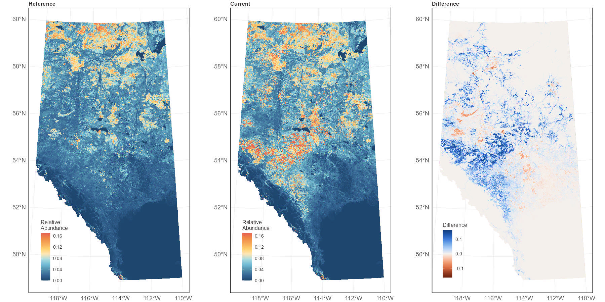

# Predictive maps

We used the ensemble landcover models that account for both bioclimate and habitat relationships to make predictions about species distributions across Alberta using 1 km^2^ spatial units under reference and current conditions. 

## Reference condition

Habitat association models, plus models describing how species varied spatially and with climate gradients, were used to predict species abundance in 1 km^2^ spatial units under reference conditions. Predictions of relative abundance of species in each 1 km^2^ unit were made after all human footprint in the 1 km^2^ unit had been ‘backfilled’ based on native vegetation in the surrounding area. 

## Current condition

Habitat association models, plus models describing how species varied spatially and with climate gradients, were used to predict species abundance in 1 km^2^ spatial units under current conditions. Predictions of relative species abundance in each 1 km^2^ unit were made based on the vegetation and human footprint present in the 1 km^2^ unit under current conditions (2023).

We also calculate the difference in relative abundance between current and reference conditions to understand how changes in human footprint have impacted species distributions (Figure 5).

{width=80%}

## Limitations 

* The maps are based on predicted habitat quality. They show the average expected abundance of a species given the habitat types, footprint, geographic location and climate of the 1 km^2^ area. We do not know the actual abundances of each species in each of the 1 km^2^ area in the province. There are many variables beyond habitat quality that determine why a species may be absent or rare at a particular place where we predict it to be common, and vice versa.
* There is uncertainty in the habitat models for each species. This model uncertainty is high for rarer species and for rarer habitat types. Uncertainty is also higher in the corners of the province, particularly the northwest and southwest, where we have limited sampling and are spatially extrapolating from our model training data. 
* The map predictions are most accurate at broad regional scales. At smaller scales, the true abundance of the species can vary from the prediction, because many factors beyond habitat quality affect a species. At small scales — individual pixels through townships — the maps show the habitat quality for the species, but should not be interpreted as showing the actual abundance of the species in that small area. 
* The underlying vegetation maps used to make the predictions are imperfect. There are classification errors in some places with greater errors for some particular habitat types (e.g., grass and shrub, mixedwood), and areas missing some of the input layers particularly outside of commercial forestry areas. We make assumptions about stand ages in about 1/3 of the forest area that is missing that information. Human footprint is more accurate, but may be 2 or 3 years out of date. 
* Reference maps only show the effects of statistically removing visible human footprint. They do not show how the species would have been distributed under ‘pristine’, ‘natural’ or ‘pre-historic’ conditions. 
* Current maps do not show effects of other human disturbances, like pollution, cattle grazing, climate change or changes on wintering grounds for migratory species.
