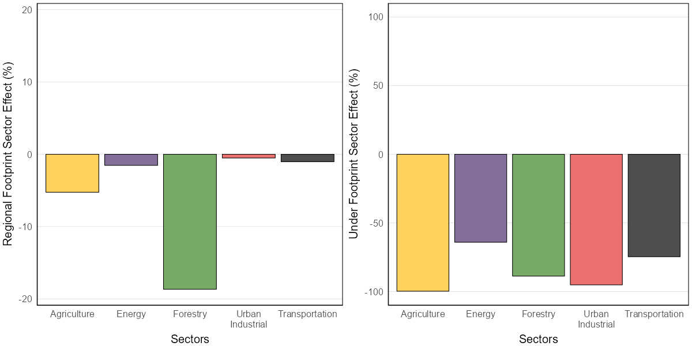

# Attribution

We calculate the effects of different industrial sectors on habitat suitability by predicting the abundance of each species in the current landbase versus a landbase in which the footprint associated with a particular industrial sector has been back-filled. ‘Back-filling’ means replacing that sector’s footprint with the vegetation or soil type that would have been present before the footprint was made. The difference between the total predicted population in the current and the back-filled landbase is the predicted effect of that sector on the abundance of a species in the region.

## Local scale effects

Local scale effects represent how habitat suitability for a species changes in the immediate area where a sector’s footprint occurs. It is the difference between the habitat suitability for a species in the native habitat prior to the footprint and its habitat suitability within the sector’s footprint itself. 

$$Local\ scale\ sector\ effect =  \frac{Current_{sector} - Reference_{sector}}{Reference_{sector}} * 100%$$

## Regional scale effects

Regional effects represent how habitat suitability in the region changes due to a sector’s footprint in that region. A sector’s effect on the regional habitat suitability for a species shows how much the habitat suitability across the region is predicted to have changed due to that sector’s footprint in the region. It is the difference between the habitat suitability for the species in the reference landscape with all human footprint removed, and the reference landscape with just that sector’s footprint added back in. 

$$Regional\ scale\ sector\ effect =  \frac{Current_{sector} - Reference_{sector}}{Reference_{landscape}} * 100%$$

Three factors determine a sector’s effect on the regional habitat suitability for a species: 

1. How much area that industry’s footprint occupies.
2. The local-footprint effect of that sector on habitat suitability.
3. What habitat types the sector operates in. 

The species most negatively affected by an industrial sector will therefore be species that are least tolerant of that sector’s footprint and that prefer to live in habitat types where more of the sector’s footprint occurs. 

{width=80%}

## Change over time

Our “backfilled” reference layer represents a hypothetical modern landscape where human footprint did not occur. In this sense, it does not represent the landscape prior to colonization, as we do not reconstruct landcover backwards in time. Therefore, in order to assess how the impacts of industrial sectors compare to natural forest dynamics (i.e., wildfires, aging), we attribute regional sector impacts between 2010 and 2021. We summarize landscape transitions into six classes:

1. Aging of native forest that is undisturbed over that span.
2. Aging of harvest areas that existed in the first year.
3. Fires.
4. New forestry footprint.
5. New non-forestry human footprint (HF) replacing native habitat and harvest areas.
6. Changes in non-forestry HF that existed in the first year.

These summaries can be interpreted the same as the regional scale effects.

## Limitations 

The sector effect results are based on each species’ habitat models applied to the maps of vegetation or soils and footprint in the region, so all the limitations of the modeling and mapping apply to these results. There are also additional caveats for sector effects:

* Where footprint types overlap, such as a well site in a cultivated field, or a road through a forestry cutblock, we assign the sector footprint type as being ‘on top’, and the effect of the footprint is allocated to the overlapping sector.
* We do not have information on which roads are associated with particular sectors, such as roads to well sites or roads in forestry cutblocks. Therefore, all roads are considered as part of the transportation sector.
* Two sectors sometimes operate together to reduce cumulative effects, such as forestry cutblocks being placed where energy developments are planned. A forestry cutblock on a future wellsite, for example, would be assigned to forestry until the wellpad was built, at which point that footprint area would change from forestry to the energy sector. 
* We have difficulty separating some types of footprint, such as urban and industrial areas, so those types are assigned to only one of the two sectors involved. 
* Sector effects only include direct effects of footprint, not indirect effects (e.g., pollution, noise, access effects) or possible cumulative effects where two or more sectors interact (e.g., roads allowing weeds into an area, where they can then colonize harvest areas).
